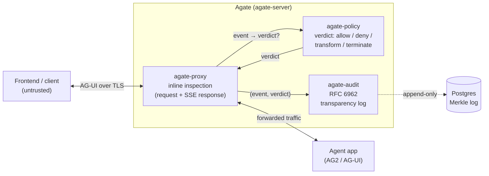

<div align="center">

# Agate

**A security gateway for LLM agents — an inline reverse proxy that inspects agent traffic, enforces policy, and writes every decision to a tamper-evident transparency log. Without changing agent code.**

[](https://github.com/C3EQUALZz/agate/actions/workflows/ci.yml)
[](https://github.com/C3EQUALZz/agate/actions/workflows/docker.yml)
[](https://C3EQUALZz.github.io/agate/)
[](https://sonarcloud.io/summary/new_code?id=C3EQUALZz_agate)
[](https://github.com/C3EQUALZz/agate/blob/main/Cargo.toml)
[](https://doc.rust-lang.org/edition-guide/rust-2024/index.html)
[](https://github.com/C3EQUALZz/agate/pkgs/container/agate)
[](LICENSE)

[Documentation](https://C3EQUALZz.github.io/agate/) ·
[Quickstart](#quickstart) ·
[Architecture](#architecture-at-a-glance) ·
[Examples](examples/) ·
[Contributing](docs/en/contributing/index.md)

**English** · [Русский](README.ru.md)

</div>

---

## Why Agate

Modern LLM agents call tools, mutate state, and stream free-form text back to a
frontend. The wire protocol they speak — [AG-UI](https://docs.ag-ui.com/) — is a
plain HTTP `POST` plus a Server-Sent Events stream. It carries **no
authentication, no per-event signatures, no size limits**, and many untyped
fields. On its own that means:

- anyone who can reach the endpoint can drive the agent;
- tool calls, state mutations, and emitted text go unchecked — a prompt-injected
  agent can exfiltrate secrets or invoke tools it should never touch;
- there is no trustworthy record of what the agent was asked to do, or did.

**Agate closes those gaps at the network edge.** It sits in front of your agent,
terminates TLS so it can inspect plaintext, **bounds** the request, **inspects**
the streamed response event-by-event, applies a **policy verdict**
(allow / deny / transform / terminate), and **appends** every `(event, verdict)`
pair to a verifiable [RFC 6962](https://www.rfc-editor.org/rfc/rfc6962) Merkle
transparency log — all without a single change to agent code.

## Features

- **Inspecting reverse proxy** — drop Agate in front of any AG-UI agent; it
  forwards traffic after inspecting it, request and SSE response alike. The
  inspection core is protocol-agnostic; AG-UI is one adapter.
- **Tool allow/deny policy** — govern which tools an agent may call with an
  `allow-all`, `allowlist`, or `denylist` mode.
- **Secret redaction** — strip configured secret markers (e.g. `sk-`, `AKIA…`)
  from emitted assistant text before it leaves the boundary.
- **RFC 6962 transparency log** — every decision is appended to a tamper-evident,
  append-only Merkle log in PostgreSQL, not a naive hash chain. Tampering is
  detectable; inclusion is provable.
- **Crypto agility** — pluggable, self-describing hash / signature / AEAD
  strategies (SHA-2/3, Streebog; Ed25519), with the algorithm tag travelling
  alongside every digest and signature.
- **TOML + env configuration** — a mounted `agate.toml` with per-key environment
  overrides (`AGATE__SECTION__KEY`); keep secrets in the environment.
- **Prometheus metrics** — an opt-in `/metrics` endpoint on its own port
  (`:9090`), kept off the public data plane; a ready-made
  [Grafana + Prometheus stack](deploy/observability/) ships in `deploy/`.
- **Graceful shutdown** — on `SIGTERM`/`SIGINT` Agate drains in-flight requests
  and **flushes the audit outbox** before exiting; safe for rolling restarts and
  Kubernetes pod termination.
- **Container-native** — published to GHCR (`ghcr.io/c3equalzz/agate`) on every
  push to `main` and on release tags.

## Quickstart

Agate runs in Docker. You need an **AG-UI agent** to put it in front of and a
**PostgreSQL** database for the transparency log (migrations run automatically).

**1. Pull the image:**

```bash
docker pull ghcr.io/c3equalzz/agate:latest
```

**2. Write `agate.toml`** (start from [`agate.example.toml`](agate.example.toml)):

```toml
[proxy]
agent_endpoint = "http://your-agent:9000/run"  # the real agent's AG-UI endpoint
bind = "0.0.0.0:8080"

[audit]
database_url = "postgres://agate@db:5432/agate"  # password via env, below

[policy.tools]
mode = "allowlist"
names = ["search", "fetch"]

[policy]
redact = ["sk-", "AKIA"]
```

**3. Run it** (pass secrets as `AGATE__*` environment overrides):

```bash
docker run --rm \
  -p 8080:8080 \
  -v "$PWD/agate.toml:/etc/agate/agate.toml:ro" \
  -e AGATE_CONFIG=/etc/agate/agate.toml \
  -e AGATE__AUDIT__DATABASE_URL='postgres://agate:secret@db:5432/agate' \
  ghcr.io/c3equalzz/agate:latest
```

**4. Point your frontend at `http://localhost:8080`** instead of at the agent.
Agate forwards every request to the agent after inspection — and records the
verdicts to the transparency log.

> A complete `docker-compose` setup (with Postgres) and a `AUDIT_LOG_ID` tip for
> reusing the same log across restarts are in the
> [Installation guide](https://C3EQUALZz.github.io/agate/getting-started/installation/).
> Runnable end-to-end demos — tool-call denial, secret redaction, audit
> verification — live under [`examples/`](examples/).

## Architecture at a glance

The proxy terminates TLS, validates the request before the agent ever runs, then
streams the response while consulting policy and feeding the audit log off the
hot path.



Agate is a Cargo workspace where **each crate is one bounded context**, built
with Domain-Driven Design and Clean Architecture; dependencies flow inward only,
and there is no shared kernel.

| Crate | Bounded context | Responsibility |
| --- | --- | --- |
| `agate-crypto` | Generic subdomain (library) | Crypto agility: pluggable, self-describing hash / signature / AEAD strategies |
| `agate-audit` | Audit | Append-only RFC 6962 transparency log |
| `agate-proxy` | Proxy (data plane) | Inline inspection of agent traffic; the event → verdict seam |
| `agate-policy` | Policy | Content & authorization decisions: tool allow/deny + secret redaction |
| `agate-server` | Composition root | Wires proxy ↔ audit ↔ policy; the Docker entrypoint |

## Documentation

Full documentation — overview, getting started, configuration, architecture, and
the threat model — is published with Material for MkDocs and is **bilingual
(English + Russian)**.

- **Documentation site:** <https://C3EQUALZz.github.io/agate/>
- **Configuration reference:** [docs/en/getting-started/configuration.md](docs/en/getting-started/configuration.md)
- **API reference (rustdoc):** `cargo doc --workspace --no-deps --open`
- Build the docs locally:

  ```bash
  python -m pip install -r docs/requirements.txt
  mkdocs serve   # http://127.0.0.1:8000
  ```

## Contributing

Contributions are welcome. The contributor contract — architecture rules, the
quality gate, the EN/RU docs sync workflow — lives in
[`AGENTS.md`](AGENTS.md) and the
[Contributing guide](docs/en/contributing/index.md). In short:

```sh
just            # list recipes
just ci         # full local gate: fmt, strict clippy, cargo-deny, typos, tests
```

Commits follow [Conventional Commits](https://www.conventionalcommits.org/); CI
runs format checks, strict clippy, tests, cargo-deny, and CodeQL.

## License

Licensed under the [MIT License](LICENSE).
