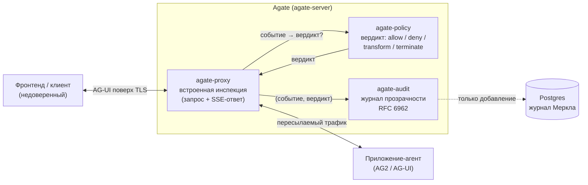

<div align="center">

# Agate

**Шлюз безопасности для LLM-агентов — встраиваемый обратный прокси, который инспектирует трафик агента, применяет политики и записывает каждое решение в защищённый от подделки журнал прозрачности. Без изменения кода агента.**

[](https://github.com/C3EQUALZz/agate/actions/workflows/ci.yml)
[](https://github.com/C3EQUALZz/agate/actions/workflows/docker.yml)
[](https://C3EQUALZz.github.io/agate/)
[](https://sonarcloud.io/summary/new_code?id=C3EQUALZz_agate)
[](https://github.com/C3EQUALZz/agate/blob/main/Cargo.toml)
[](https://doc.rust-lang.org/edition-guide/rust-2024/index.html)
[](https://github.com/C3EQUALZz/agate/pkgs/container/agate)
[](LICENSE)

[Документация](https://C3EQUALZz.github.io/agate/) ·
[Быстрый старт](#быстрый-старт) ·
[Архитектура](#архитектура-вкратце) ·
[Примеры](examples/) ·
[Участие в проекте](docs/ru/contributing/index.md)

[English](README.md) · **Русский**

</div>

---

## Зачем нужен Agate

Современные LLM-агенты вызывают инструменты, изменяют состояние и возвращают
фронтенду свободный текст потоком. Протокол, на котором они общаются —
[AG-UI](https://docs.ag-ui.com/) — это обычный HTTP `POST` плюс поток
Server-Sent Events. Он не несёт **ни аутентификации, ни подписей отдельных
событий, ни ограничений на размер**, и содержит множество нетипизированных
полей. Сам по себе это означает, что:

- любой, кто может достучаться до эндпоинта, способен управлять агентом;
- вызовы инструментов, изменения состояния и выдаваемый текст никем не
  проверяются — агент с внедрённой инъекцией промпта может выкрасть секреты
  или вызвать инструменты, к которым ему нельзя прикасаться;
- нет достоверной записи о том, что агента просили сделать и что он сделал.

**Agate закрывает эти пробелы на сетевом периметре.** Он встаёт перед вашим
агентом, терминирует TLS, чтобы инспектировать открытый трафик, **ограничивает**
запрос, **инспектирует** потоковый ответ событие за событием, выносит **вердикт
политики** (разрешить / запретить / преобразовать / прервать) и **добавляет**
каждую пару `(событие, вердикт)` в проверяемый журнал прозрачности Меркла по
[RFC 6962](https://www.rfc-editor.org/rfc/rfc6962) — и всё это без единого
изменения в коде агента.

## Возможности

- **Инспектирующий обратный прокси** — ставится перед любым AG-UI-агентом; он
  пересылает трафик после инспекции, как запросы, так и SSE-ответы. Ядро
  инспекции не зависит от протокола; AG-UI — лишь один из адаптеров.
- **Политика разрешения/запрета инструментов** — управление тем, какие
  инструменты может вызывать агент, в режимах `allow-all`, `allowlist` или
  `denylist`.
- **Редактирование секретов** — удаление настроенных маркеров секретов
  (например `sk-`, `AKIA…`) из выдаваемого текста ассистента до того, как он
  покинет периметр.
- **Журнал прозрачности RFC 6962** — каждое решение добавляется в защищённый от
  подделки append-only журнал Меркла в PostgreSQL, а не в наивную хеш-цепочку.
  Подделка обнаруживается, включённость доказуема.
- **Криптоагильность** — подключаемые самоописывающиеся стратегии хеширования /
  подписи / AEAD (SHA-2/3, Streebog; Ed25519), причём тег алгоритма
  сопровождает каждый дайджест и подпись.
- **Конфигурация через TOML + переменные окружения** — монтируемый `agate.toml`
  с переопределением по ключам через окружение (`AGATE__SECTION__KEY`); секреты
  держите в окружении.
- **Метрики Prometheus** — опциональный эндпоинт `/metrics` на отдельном порту
  (`:9090`), вынесенный за пределы публичного дата-плейна; готовый стек
  [Grafana + Prometheus](deploy/observability/) лежит в `deploy/`.
- **Корректное завершение** — по `SIGTERM`/`SIGINT` Agate доводит до конца
  текущие запросы и **сбрасывает аудиторский outbox** перед выходом; безопасно
  для rolling-рестартов и завершения подов в Kubernetes.
- **Container-native** — публикуется в GHCR (`ghcr.io/c3equalzz/agate`) при
  каждом push в `main` и на тегах релизов.

## Быстрый старт

Agate работает в Docker. Вам понадобится **AG-UI-агент**, перед которым его
поставить, и база **PostgreSQL** для журнала прозрачности (миграции запускаются
автоматически).

**1. Загрузите образ:**

```bash
docker pull ghcr.io/c3equalzz/agate:latest
```

**2. Напишите `agate.toml`** (отталкивайтесь от [`agate.example.toml`](agate.example.toml)):

```toml
[proxy]
agent_endpoint = "http://your-agent:9000/run"  # реальный AG-UI-эндпоинт агента
bind = "0.0.0.0:8080"

[audit]
database_url = "postgres://agate@db:5432/agate"  # пароль — через окружение, ниже

[policy.tools]
mode = "allowlist"
names = ["search", "fetch"]

[policy]
redact = ["sk-", "AKIA"]
```

**3. Запустите** (секреты передавайте через переопределения окружения `AGATE__*`):

```bash
docker run --rm \
  -p 8080:8080 \
  -v "$PWD/agate.toml:/etc/agate/agate.toml:ro" \
  -e AGATE_CONFIG=/etc/agate/agate.toml \
  -e AGATE__AUDIT__DATABASE_URL='postgres://agate:secret@db:5432/agate' \
  ghcr.io/c3equalzz/agate:latest
```

**4. Направьте фронтенд на `http://localhost:8080`** вместо самого агента. Agate
пересылает каждый запрос агенту после инспекции — и записывает вердикты в
журнал прозрачности.

> Полная конфигурация `docker-compose` (с Postgres) и совет по `AUDIT_LOG_ID`
> для переиспользования одного журнала между рестартами — в
> [руководстве по установке](https://C3EQUALZz.github.io/agate/getting-started/installation/).
> Готовые сквозные демо — запрет вызова инструмента, редактирование секретов,
> проверка аудита — лежат в [`examples/`](examples/).

## Архитектура вкратце

Прокси терминирует TLS, проверяет запрос до того, как агент вообще запустится,
а затем стримит ответ, советуясь с политикой и питая журнал аудита вне горячего
пути.



Agate — это Cargo-workspace, где **каждый крейт — один ограниченный контекст**,
построенный по Domain-Driven Design и Clean Architecture; зависимости текут
только внутрь, общего ядра (shared kernel) нет.

| Крейт | Ограниченный контекст | Ответственность |
| --- | --- | --- |
| `agate-crypto` | Обобщённый поддомен (библиотека) | Криптоагильность: подключаемые самоописывающиеся стратегии хеш / подпись / AEAD |
| `agate-audit` | Аудит | Append-only журнал прозрачности RFC 6962 |
| `agate-proxy` | Прокси (дата-плейн) | Встроенная инспекция трафика агента; шов «событие → вердикт» |
| `agate-policy` | Политика | Решения по содержимому и авторизации: разрешение/запрет инструментов + редактирование секретов |
| `agate-server` | Корень композиции | Связывает proxy ↔ audit ↔ policy; точка входа Docker |

## Документация

Полная документация — обзор, начало работы, конфигурация, архитектура и модель
угроз — публикуется на Material for MkDocs и **двуязычна (английский +
русский)**.

- **Сайт документации:** <https://C3EQUALZz.github.io/agate/>
- **Справочник по конфигурации:** [docs/ru/getting-started/configuration.md](docs/ru/getting-started/configuration.md)
- **Справочник API (rustdoc):** `cargo doc --workspace --no-deps --open`
- Собрать документацию локально:

  ```bash
  python -m pip install -r docs/requirements.txt
  mkdocs serve   # http://127.0.0.1:8000
  ```

## Участие в проекте

Контрибьюции приветствуются. Контракт участника — правила архитектуры,
quality-gate, процесс синхронизации EN/RU документации — описан в
[`AGENTS.md`](AGENTS.md) и [руководстве для участников](docs/ru/contributing/index.md).
Вкратце:

```sh
just            # список рецептов
just ci         # полный локальный гейт: fmt, строгий clippy, cargo-deny, typos, тесты
```

Коммиты следуют [Conventional Commits](https://www.conventionalcommits.org/); CI
прогоняет проверки форматирования, строгий clippy, тесты на Linux/macOS/Windows,
cargo-deny и CodeQL.

## Лицензия

Распространяется под [лицензией MIT](LICENSE).
