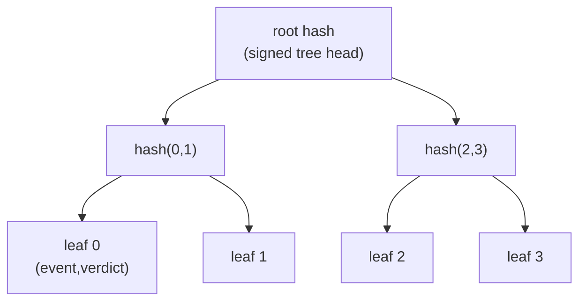

# agate-audit

> The audit bounded context: an append-only **transparency log** modeled as an
> RFC 6962-style Merkle tree.

`agate-audit` records every `(event, verdict)` the proxy produces into a
**tamper-evident, append-only** log. Rather than a naive hash chain, it uses an
[RFC 6962](https://www.rfc-editor.org/rfc/rfc6962) Merkle tree, which supports
efficient **inclusion** and **consistency** proofs.

## Responsibility

- Append entries and maintain a Merkle tree over them.
- Produce a **signed tree head** (the root, size, and algorithm epoch, signed).
- Answer **inclusion proofs** (entry *i* is in the tree of head *H*) and
  **consistency proofs** (head *H₂* is an append-only extension of *H₁*).
- Stay verifiable across **crypto epochs** (see [agate-crypto](crypto.md)).

## The Merkle transparency log

Appending a leaf recomputes the path to the root; the new signed tree head
commits to the whole history, so any retroactive edit of a past entry changes
the root and breaks every later head.

## Domain language

- `TransparencyLog` — the **aggregate root** (embeds a domain-event collection).
- Merkle **values**, **entities**, **services** (hashing), and **factories**
  under `domain/merkle/`.
- Domain **ports**: `Clock`, `IdGenerator`.

## Layering

| Layer | Contents |
| --- | --- |
| `domain` | Pure entities, value objects, and domain services (Merkle hashing, the `TransparencyLog` aggregate, proofs). No I/O. |
| `application` | CQRS use cases (command/query handlers) over a mediator pipeline; pipeline **behaviors** (`TransactionBehavior`, `MetricsBehavior`); outbound ports (`KeyStore`, `CheckpointAnchor`, `EventOutbox`, `TransactionManager`, `AuditMetrics`, and the CQRS log gateways). |
| `infrastructure` | Concrete adapters: `SystemClock`, `UuidLogIdGenerator`, `PostgresLog{Command,Query}Gateway`, transaction management, migrations. |
| `presentation` | HTTP handlers (health, versioned routes) and `AuditError → HTTP` mapping. |
| `setup` | Composition root: typed config from env, the `froodi` IoC container, HTTP bootstrap. |

Persistence is **CQRS-split**: a command gateway loads/saves the aggregate
(write side); a query gateway returns read models/DTOs (read side). The crate
depends inward on [`agate-crypto`](crypto.md) for hashing and signing.

## Observability

Append metrics are **application logic hidden behind a port**, not `counter!`
calls scattered through the code. An `AuditMetrics` port is recorded by a
`MetricsBehavior` in the mediator pipeline, registered **outermost** on
`AppendRecord` so it counts the outcome *after* the transaction behavior commits
or rolls back: one `agate_audit_records_appended_total` on success, one
`agate_audit_records_dropped_total` on failure. The infrastructure adapter
writes through the `metrics` facade; unit tests drive the behavior with a fake.
Records dropped *before* they reach the pipeline (outbox scope-open failures,
sink backpressure) are counted through the same port at the [server](server.md).

## Invariants & testing

Merkle proof round-trips and tamper rejection are covered with **proptest**.
Database-backed gateways are tested with **testcontainers** in the
infrastructure layer.
