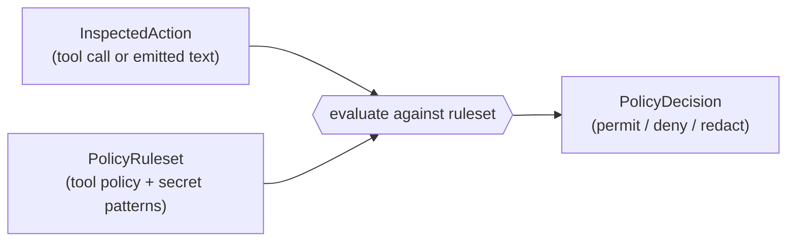

# agate-policy

> The policy bounded context: it decides **content and authorization** verdicts
> for the actions an agent attempts — which tools may run, and whether emitted
> text must be redacted before it reaches the client.

`agate-policy` is a **pure, self-contained context**. It speaks its own
ubiquitous language — `InspectedAction` in, `PolicyDecision` out — and depends
on **no other context**. The proxy's *structural* inspection and this *content*
policy meet only at the [server](server.md) composition root, which translates
between the two vocabularies. There is **no shared kernel**.

## Responsibility

- **Tool authorization:** decide whether a tool call is permitted, given a
  ruleset of `AllowAll`, an **allowlist**, or a **denylist**.
- **Secret redaction:** decide whether emitted text must be redacted, given a
  set of secret patterns.

## Decision flow

The composition root maps a `PolicyDecision` onto the proxy's `Verdict`
(`Allow` / `Deny` / `Transform`), keeping the two contexts decoupled.

## Domain language

- `InspectedAction` — the input: a tool invocation, a piece of emitted text, a
  tool result, or a state mutation.
- `PolicyDecision` — the output verdict in policy terms.
- `PolicyRuleset` — the configured rules: a `ToolPolicy`, argument deny rules,
  and secret patterns.
- `ToolPolicy` — `AllowAll`, `Allowlist(set)`, or `Denylist(set)`.
- `ArgumentRule` — denies a permitted tool call whose arguments contain a marker
  (optionally scoped to one tool); applied by `ArgumentInspector` after name
  authorization.
- `ToolName`, `SecretPattern` — validated value objects (a blank or invalid
  entry is rejected at construction). `SecretPattern` is a literal (ASCII
  case-insensitive) or a regex.

## Layering

| Layer | Contents |
| --- | --- |
| `domain` | Pure: `InspectedAction`, `PolicyDecision`, `PolicyRuleset`, `ToolPolicy`, value objects, and the evaluation domain service. No async/I/O. |
| `application` | Use cases over the domain (verdict computation). |

This context is small and pure today; it gains `infrastructure`/`presentation`
layers only when it needs adapters of its own.

## Configuration

Rules are supplied at the server composition root from the `POLICY_*`
environment variables (allowlist / denylist / redaction markers). Allowlist and
denylist are **mutually exclusive**; with neither set, every tool is permitted
and nothing is redacted. See [Configuration](../../getting-started/configuration.md).
