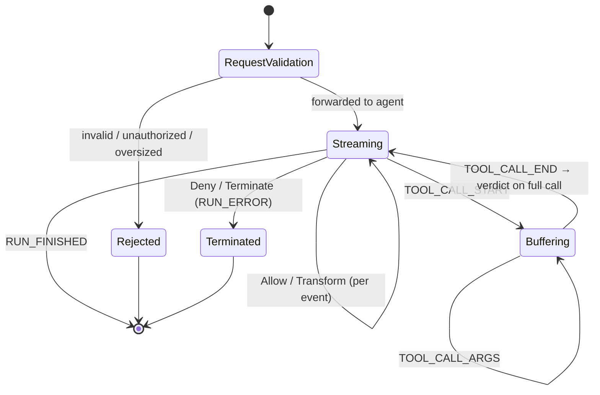

# agate-proxy

> The proxy bounded context: an inline reverse proxy that inspects LLM-agent
> traffic and decides — per event — whether to allow, deny, transform, buffer,
> or terminate it.

`agate-proxy` is the **data plane**. The inspection core is
**protocol-agnostic**: the wire protocol (AG-UI first, an agent ↔ LLM adapter
later) enters through an **adapter** that translates wire events into domain
events. See the [Threat Model](../threat-model.md) for the full design.

## Responsibility

- Terminate TLS and accept the AG-UI request (`RunAgentInput`).
- **Request leg (preventive):** validate, authorize, and size-bound the request
  *before* forwarding — reject early so the agent never runs on bad input.
- **Response leg (streaming):** parse the SSE event stream incrementally and,
  per event, apply a **verdict** — forwarding, redacting, or terminating.
- Buffer tool-call argument fragments between `TOOL_CALL_START` and
  `TOOL_CALL_END` so a verdict sees the **complete** arguments.
- Feed each `(event, verdict)` to the audit sink, off the forwarding hot path.

## The inspection state machine

## The event → verdict seam

Inspection produces, per event (or per buffered logical unit), a **verdict**:

| Verdict | Meaning |
| --- | --- |
| `Allow` | forward unchanged |
| `Deny(reason)` | block; on the response leg, surface as `RUN_ERROR` |
| `Transform(replacement)` | forward a modified event (e.g. redacted content) |
| `Buffer` | need more frames before deciding (e.g. mid tool-call) |
| `Terminate(reason)` | end the run/stream |

This single seam is where two contexts plug in via ports:
[`agate-policy`](policy.md) **computes** the verdict (a `PolicyPort`), and
[`agate-audit`](audit.md) **records** `(event, verdict)`. The proxy depends only
on the ports; the concrete policy and audit adapters are injected at the
[server](server.md) composition root. The first milestone ships a trivial
**allow-all** policy adapter behind `PolicyPort`.

## Domain language

- `Session` / `Run` — the inspection aggregate(s).
- `InspectedEvent` — protocol-agnostic event value objects.
- `Verdict` — the decision value object listed above.

## Layering

| Layer | Contents |
| --- | --- |
| `domain` | Pure: inspection aggregates, `InspectedEvent`, `Verdict`. No I/O. |
| `application` | Use cases and ports: `PolicyPort` (verdict source), an audit sink, the upstream agent client. |
| `infrastructure` | Adapters: the AG-UI SSE codec (incremental, order-preserving), `RunAgentInput` validation, the HTTP client to the agent. |
| `presentation` | HTTP/SSE handlers (axum/hyper), TLS termination, request/response wiring. |
| `setup` | Composition root: `ProxyConfig` (`AGENT_ENDPOINT`, `BIND_ADDR`), assembly. |

## Fail-open vs fail-closed

Whether a policy error fails **open** (forward) or **closed** (block) is a
**per-deployment** decision — see [Configuration](../../getting-started/configuration.md).
