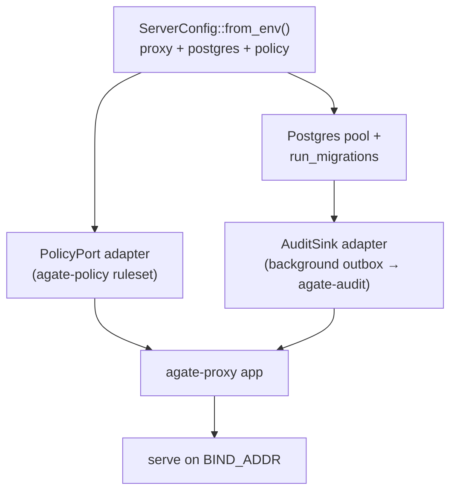

# agate-server

> The composition root for the whole system: it wires the **proxy** data plane
> to the **audit** transparency log and the **policy** decisions, and is the
> Docker entrypoint.

`agate-server` owns **no domain of its own**. It is the outermost layer that
composes the bounded contexts behind their public ports.

## Responsibility

- Read configuration from the environment (`ServerConfig`: proxy + Postgres +
  policy).
- Build the Postgres pool and run the audit migrations.
- Supply the adapters that connect the contexts:
    - a `PolicyPort` adapter backed by [`agate-policy`](policy.md);
    - an `AuditSink` adapter that turns each inspected event into an append on
      the [`agate-audit`](audit.md) log — **off the forwarding hot path** via a
      background outbox.
- Build the proxy app ([`agate-proxy`](proxy.md)) and serve it.

## Composition

Because the proxy depends only on its `PolicyPort` and `AuditSink` *ports*, this
crate is the **only** place the three contexts are aware of one another — and
the only place a `PolicyDecision` is translated into a proxy `Verdict`.

## Entrypoint behavior

The `main` flow is: read config → build pool → migrate → resolve the
transparency log → build the proxy app → serve.

- If `AUDIT_LOG_ID` is set, that log is reused; otherwise a fresh log is created
  and its id is logged so operators can pin it on restart.
- See [Installation](../../getting-started/installation.md) and
  [Configuration](../../getting-started/configuration.md) for the environment
  variables.

## Layering

| Layer | Contents |
| --- | --- |
| `infrastructure` | The `AuditSink` / policy adapters that bridge the contexts. |
| `setup` | `ServerConfig` and the bootstrap that assembles and serves the app. |
