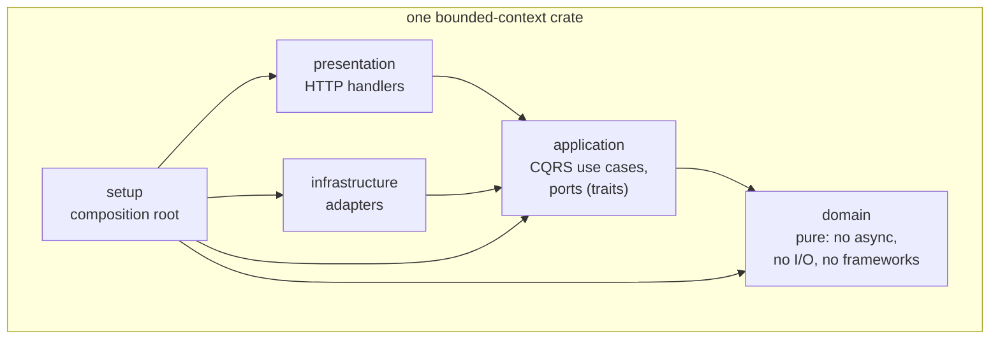
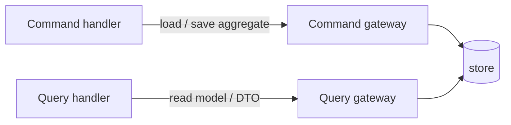

# Architecture & DDD

Agate follows **Domain-Driven Design** and **Clean Architecture**. This page
states the rules that every crate obeys; they are the contract for anyone
working in the repository (see `AGENTS.md`).

## The dependency rule

Dependencies flow **inward only**. Within a bounded-context crate the layers are
modules, added outward as the context grows:

- The **`domain` layer is pure**: no `async`, no I/O, no framework
  dependencies. This is enforced *structurally* by the acyclic crate graph — a
  domain module cannot use what is not in the crate's `Cargo.toml`.
- **Depend on abstractions, not implementations.** Ports are traits; concrete
  adapters are injected at the composition root. The DI framework (`froodi`)
  stays out of the domain and application layers.
- **Composition over inheritance.** Rust has no inheritance; reuse comes from
  traits + default methods, struct embedding, generics, and derives.

## Crate = bounded context, no shared kernel

Each crate owns its aggregates and its domain. There is **no shared kernel**.
Cross-context *technical* capabilities — cryptography being the prime example —
are published as **generic-subdomain libraries** with a stable interface, not as
shared domain models. Depending on `agate-crypto` is like depending on `sha2` or
`ring`: a technical capability, not a shared domain.

When two contexts must interact (for example proxy structural inspection and
policy content decisions), they meet **only at the composition root**, which
translates between their vocabularies. The contexts never import each other.

## DDD building blocks in Rust

| Building block | How it is realized |
| --- | --- |
| **Value object** | `#[derive(Clone, PartialEq, Eq, Hash)]` + `impl ValueObject`; private fields; a validating smart constructor `new(..) -> Result<Self, DomainError>` (*parse, don't validate*); immutable — mutators return a new value. |
| **Entity** | Implements `Entity` (identity-based equality). Identity and lifecycle are composed from explicit parts (an `id` field + a `Timestamps` value object), never a `Meta` bag. |
| **Aggregate root** | Embeds `EventCollection<E>`, implements `AggregateRoot`. Construction is exposed **only** through a `Factory` that injects collaborators; `new`/`reconstitute` are `pub(crate)`. |
| **Domain service** | A stateless unit struct + `impl DomainService`. |
| **Factory** | The only public way to build an aggregate; injects collaborators (clock, id generator). |
| **Errors** | A hierarchy of nested `enum`s (`DomainError::Time(TimeError)`) wired through `Error::source()`. |
| **Ports** | `Clock` and `IdGenerator` are **domain ports**. Persistence and external systems are **application ports**, split CQRS-style: a **command gateway** loads/saves the aggregate (write side); a **query gateway** returns read models/DTOs (read side). |

### CQRS persistence

Persistence is split so the write model (the aggregate) and the read model (DTOs
/ projections) evolve independently:

## Why this matters

The purity of the domain and the acyclic crate graph mean correctness-critical
logic (Merkle proofs, verdict computation, value-object invariants) is testable
in isolation with no network or clock, and the compiler enforces the layering.
Algebraic and cryptographic invariants (e.g. Merkle proof round-trips, tamper
rejection) are covered with **proptest**; contexts without such invariants, like
the policy, use example-based scenario tests.

See the per-context pages for how each crate applies these rules:
[crypto](contexts/crypto.md), [audit](contexts/audit.md),
[proxy](contexts/proxy.md), [policy](contexts/policy.md),
[server](contexts/server.md).
