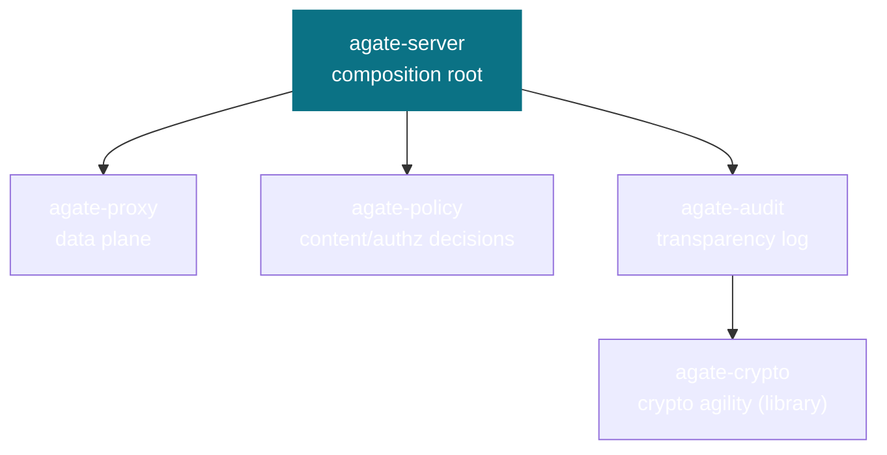

# Architecture

Agate is a Cargo workspace in which **each crate is one bounded context**.
Inside a context, Clean Architecture layers are modules and files are grouped by
DDD object type. Dependencies flow **inward only**, and there is **no shared
kernel** — cross-context technical capabilities (such as cryptography) are
published as generic-subdomain *libraries*, not shared domain models.

## The crate graph



`agate-server` composes the others behind their public ports. `agate-proxy` and
`agate-policy` never depend on each other directly — their vocabularies meet
only at the composition root, which translates between them. `agate-audit`
depends on `agate-crypto` for hashing and signing strategies.

## The single decision seam

The whole system pivots on one seam in the proxy: for each inspected event (or
each buffered logical unit such as a complete tool call), a **verdict** is
produced.

```mermaid
flowchart LR
    ev["Inspected event"] --> seam{{"event → verdict"}}
    seam --> allow["Allow — forward unchanged"]
    seam --> deny["Deny — block (RUN_ERROR)"]
    seam --> transform["Transform — forward modified"]
    seam --> buffer["Buffer — need more frames"]
    seam --> terminate["Terminate — end the run"]
    seam -.->|asks| policy["agate-policy"]
    seam -.->|records (event, verdict)| audit["agate-audit"]
```

## Read on

- **[Architecture & DDD](ddd.md)** — the dependency rule, the no-shared-kernel
  decision, and the DDD building blocks (value objects, entities, aggregates,
  factories, ports) as applied in Rust.
- **[Threat Model](threat-model.md)** — what the proxy defends, against whom,
  and the deployment topology.
- **Bounded Contexts** — one page per crate:
  [crypto](contexts/crypto.md) ·
  [audit](contexts/audit.md) ·
  [proxy](contexts/proxy.md) ·
  [policy](contexts/policy.md) ·
  [server](contexts/server.md).
