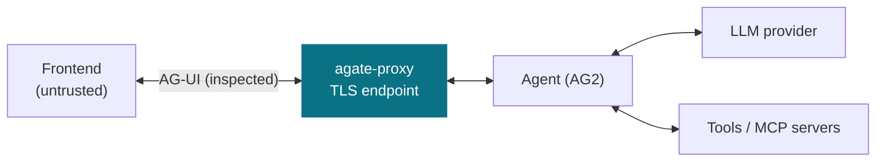

# Threat Model

This page surfaces the accepted design document for the `agate-proxy` bounded
context — the data plane that inspects LLM-agent traffic. It defines **what the
proxy defends, against whom, where it sits, and the single decision seam**
(event → verdict) that the audit and policy contexts plug into.

The canonical source lives in the repository at
[`docs/design/agate-proxy-threat-model.md`](https://github.com/C3EQUALZz/agate/blob/main/docs/design/agate-proxy-threat-model.md)
and is included verbatim below, so the published docs and the in-repo design
record never drift apart.

!!! abstract "At a glance"
    - **Mode:** hybrid inline — preventive on the request leg, streaming
      inspection on the response leg.
    - **TLS:** terminated at the proxy (required to inspect plaintext).
    - **Seam:** every inspected event yields a verdict
      (`Allow` / `Deny` / `Transform` / `Buffer` / `Terminate`); `agate-policy`
      computes it, `agate-audit` records it.

---

--8<-- "design/agate-proxy-threat-model.md"
