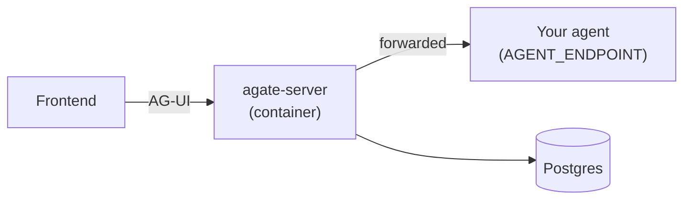

# Getting Started

Agate runs as a single container that you place **in front of** your existing
AG-UI agent. Your frontend connects to Agate instead of to the agent directly;
Agate inspects, decides, records, and forwards.

This section covers:

1. **[Installation (Docker)](installation.md)** — pull/build the image, set the
   handful of environment variables, point it at your agent, and run it.
2. **[Configuration](configuration.md)** — the environment variables Agate reads
   today, and the file-based `agate.toml` configuration that is being designed.

!!! note "Status"
    Agate is in early development (`0.1.0`). The data-plane proxy, the audit
    transparency log, and a first policy (tool allow/deny + secret redaction)
    are in place. A published Docker image and the `agate.toml` config file are
    still being finalized — see the notes on each page.
