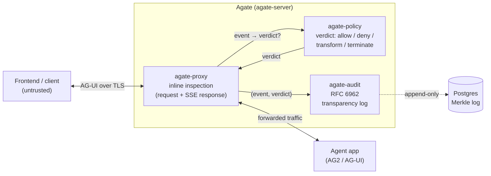

# Agate

**Agate is a security gateway for LLM agents.** It is an inline reverse proxy
that sits in front of an agent application, inspects the traffic flowing in both
directions, enforces policy on what the agent may do, and records every decision
to a tamper-evident, append-only transparency log — **without changing agent
code**.

The first protocol Agate speaks is **AG-UI** (with [AG2](https://docs.ag2.ai/)
as the reference agent framework), but the inspection core is
protocol-agnostic: AG-UI is one adapter, and an agent ↔ LLM-provider adapter can
be added later without touching the core.

## The problem it solves

The AG-UI protocol is an HTTP `POST` of a `RunAgentInput` body (client → agent)
plus a Server-Sent Events stream of events back (agent → client). It carries no
authentication, no per-event signatures, no size limits, and many untyped
`any`-shaped fields. On its own, that means:

- anyone who can reach the endpoint can drive the agent;
- tool calls, state mutations, and emitted text are unchecked;
- there is no trustworthy record of what the agent was asked to do, or did.

Agate closes those gaps at the network edge. It **authenticates and bounds** the
request, **inspects** the streamed response event-by-event, applies a
**policy verdict** (allow / deny / transform / terminate), and **appends** the
`(event, verdict)` pair to a verifiable [RFC 6962](https://www.rfc-editor.org/rfc/rfc6962)
Merkle transparency log.

## High-level architecture

The proxy terminates TLS (so it can inspect plaintext), validates the request
before the agent ever runs, then streams the response while consulting policy
and feeding the audit log off the hot path.

## How it is built

Agate is a Cargo workspace where **each crate is one bounded context**, built
with Domain-Driven Design and Clean Architecture. Dependencies flow inward only;
there is no shared kernel.

| Crate | Bounded context | Responsibility |
| --- | --- | --- |
| [`agate-crypto`](architecture/contexts/crypto.md) | Generic subdomain (library) | Crypto agility: pluggable, self-describing hash / signature / AEAD strategies |
| [`agate-audit`](architecture/contexts/audit.md) | Audit | Append-only RFC 6962 transparency log |
| [`agate-proxy`](architecture/contexts/proxy.md) | Proxy (data plane) | Inline inspection of agent traffic; the event → verdict seam |
| [`agate-policy`](architecture/contexts/policy.md) | Policy | Content & authorization decisions: tool allow/deny + secret redaction |
| [`agate-server`](architecture/contexts/server.md) | Composition root | Wires proxy ↔ audit ↔ policy; the Docker entrypoint |

## Where to go next

-   :material-rocket-launch: **[Getting Started](getting-started/index.md)**

    Run Agate in front of your agent with Docker.

-   :material-cog: **[Configuration](getting-started/configuration.md)**

    Environment variables today; a mounted `agate.toml` is coming.

-   :material-sitemap: **[Architecture](architecture/index.md)**

    The bounded contexts, the DDD rules, and the threat model.

-   :material-book-open-variant: **[Reference](reference/index.md)**

    The rustdoc API reference.

