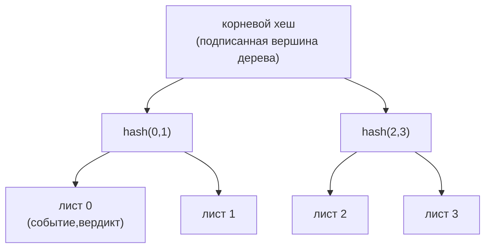

# agate-audit

> Ограниченный контекст аудита: **журнал прозрачности** с возможностью только
> добавления, смоделированный как дерево Меркла в стиле RFC 6962.

`agate-audit` записывает каждую пару `(событие, вердикт)`, произведённую прокси,
в **защищённый от подделки** журнал с возможностью только добавления. Вместо
наивной хеш-цепочки он использует дерево Меркла
[RFC 6962](https://www.rfc-editor.org/rfc/rfc6962), которое поддерживает
эффективные доказательства **включения** и **согласованности**.

## Ответственность

- Добавлять записи и поддерживать дерево Меркла над ними.
- Производить **подписанную вершину дерева** (корень, размер и эпоху алгоритма,
  подписанные).
- Отвечать на доказательства **включения** (запись *i* находится в дереве с
  вершиной *H*) и **согласованности** (вершина *H₂* является добавочным
  расширением *H₁*).
- Оставаться проверяемым через **крипто-эпохи** (см. [agate-crypto](crypto.md)).

## Журнал прозрачности на дереве Меркла

Добавление листа пересчитывает путь к корню; новая подписанная вершина дерева
фиксирует всю историю, так что любое ретроактивное изменение прошлой записи
меняет корень и ломает каждую последующую вершину.

## Язык домена

- `TransparencyLog` — **корень агрегата** (встраивает коллекцию доменных событий).
- Меркловы **значения**, **сущности**, **сервисы** (хеширование) и **фабрики**
  под `domain/merkle/`.
- Доменные **порты**: `Clock`, `IdGenerator`.

## Слои

| Слой | Содержимое |
| --- | --- |
| `domain` | Чистые сущности, объекты-значения и доменные сервисы (хеширование Меркла, агрегат `TransparencyLog`, доказательства). Без I/O. |
| `application` | Сценарии CQRS (командные/запросные обработчики) над конвейером-медиатором; исходящие порты (`KeyStore`, `CheckpointAnchor`, `EventOutbox`, `TransactionManager` и шлюзы журнала по CQRS). |
| `infrastructure` | Конкретные адаптеры: `SystemClock`, `UuidLogIdGenerator`, `PostgresLog{Command,Query}Gateway`, управление транзакциями, миграции. |
| `presentation` | HTTP-обработчики (health, версионированные маршруты) и отображение `AuditError → HTTP`. |
| `setup` | Корень композиции: типизированная конфигурация из окружения, IoC-контейнер `froodi`, бутстрап HTTP. |

Персистентность **разделена по CQRS**: командный шлюз загружает/сохраняет агрегат
(сторона записи); запросный шлюз возвращает модели чтения/DTO (сторона чтения).
Крейт зависит внутрь от [`agate-crypto`](crypto.md) ради хеширования и подписи.

## Инварианты и тестирование

Round-trip доказательств Меркла и отклонение подделки покрываются **proptest**.
Шлюзы на базе БД тестируются с **testcontainers** в слое infrastructure.
