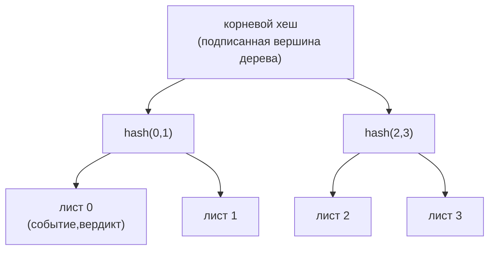

# agate-audit

> Ограниченный контекст аудита: **журнал прозрачности** с возможностью только
> добавления, смоделированный как дерево Меркла в стиле RFC 6962.

`agate-audit` записывает каждую пару `(событие, вердикт)`, произведённую прокси,
в **защищённый от подделки** журнал с возможностью только добавления. Вместо
наивной хеш-цепочки он использует дерево Меркла
[RFC 6962](https://www.rfc-editor.org/rfc/rfc6962), которое поддерживает
эффективные доказательства **включения** и **согласованности**.

## Ответственность

- Добавлять записи и поддерживать дерево Меркла над ними.
- Производить **подписанную вершину дерева** (корень, размер и эпоху алгоритма,
  подписанные).
- Отвечать на доказательства **включения** (запись *i* находится в дереве с
  вершиной *H*) и **согласованности** (вершина *H₂* является добавочным
  расширением *H₁*).
- Оставаться проверяемым через **крипто-эпохи** (см. [agate-crypto](crypto.md)).

## Журнал прозрачности на дереве Меркла

Добавление листа пересчитывает путь к корню; новая подписанная вершина дерева
фиксирует всю историю, так что любое ретроактивное изменение прошлой записи
меняет корень и ломает каждую последующую вершину.

## Язык домена

- `TransparencyLog` — **корень агрегата** (встраивает коллекцию доменных событий).
- Меркловы **значения**, **сущности**, **сервисы** (хеширование) и **фабрики**
  под `domain/merkle/`.
- Доменные **порты**: `Clock`, `IdGenerator`.

## Слои

| Слой | Содержимое |
| --- | --- |
| `domain` | Чистые сущности, объекты-значения и доменные сервисы (хеширование Меркла, агрегат `TransparencyLog`, доказательства). Без I/O. |
| `application` | Сценарии CQRS (командные/запросные обработчики) над конвейером-медиатором; конвейерные **поведения** (`TransactionBehavior`, `MetricsBehavior`); исходящие порты (`KeyStore`, `CheckpointAnchor`, `EventOutbox`, `TransactionManager`, `AuditMetrics` и шлюзы журнала по CQRS). |
| `infrastructure` | Конкретные адаптеры: `SystemClock`, `UuidLogIdGenerator`, `PostgresLog{Command,Query}Gateway`, управление транзакциями, миграции, `Ed25519KeyStore`, `LoggingCheckpointAnchor`. |
| `presentation` | HTTP-обработчики (health, версионированные маршруты) и отображение `AuditError → HTTP`. |
| `setup` | Корень композиции: типизированная конфигурация из окружения, IoC-контейнер `froodi`, бутстрап HTTP. |

Персистентность **разделена по CQRS**: командный шлюз загружает/сохраняет агрегат
(сторона записи); запросный шлюз возвращает модели чтения/DTO (сторона чтения).
Крейт зависит внутрь от [`agate-crypto`](crypto.md) ради хеширования и подписи.

## Checkpoint'ы (подписанные tree head)

**Checkpoint** — это *подписанный tree head*: корень Меркла и размер на момент
времени, подписанные так, чтобы любой мог проверить состояние журнала и выявить
подделку. `POST /logs/{id}/checkpoint` с телом `{"key_id": "…"}` запускает команду
`IssueCheckpoint`: снимает head, подписывает его настроенным ключом Ed25519,
**анкорит** (публикует вовне), сохраняет агрегат и возвращает подписанный tree
head (размер, корень, метка времени, id ключа, алгоритм, подпись — бинарное в
hex).

Ключ подписи берётся из окружения — 32-байтовый seed `AUDIT_CHECKPOINT_SEED`
(64 hex-символа) под `AUDIT_CHECKPOINT_KEY_ID` (по умолчанию `checkpoint-ed25519`).
Без настроенного seed запросы checkpoint падают с понятной ошибкой, а не
подписываются эфемерным ключом, которому никакой верификатор не сможет доверять
между перезапусками. Порт `CheckpointAnchor` — это шов для **независимого
свидетеля** (защита от split-view / двусмысленности); адаптер по умолчанию
логирует head для внешнего сбора.

## Наблюдаемость

Метрики добавления — это **прикладная логика, скрытая за портом**, а не вызовы
`counter!`, разбросанные по коду. Порт `AuditMetrics` вызывается из
`MetricsBehavior` в конвейере-медиаторе, зарегистрированного **самым внешним** на
`AppendRecord`, чтобы учитывать исход *после* того, как поведение транзакции
зафиксировало или откатило её: один `agate_audit_records_appended_total` при
успехе, один `agate_audit_records_dropped_total` при ошибке. Инфраструктурный
адаптер пишет через фасад `metrics`; модульные тесты гоняют поведение с фейком.
Записи, отброшенные *до* конвейера (сбой открытия scope в outbox, backpressure в
sink), учитываются через тот же порт на стороне [сервера](server.md).

## Инварианты и тестирование

Round-trip доказательств Меркла и отклонение подделки покрываются **proptest**.
Шлюзы на базе БД тестируются с **testcontainers** в слое infrastructure.
