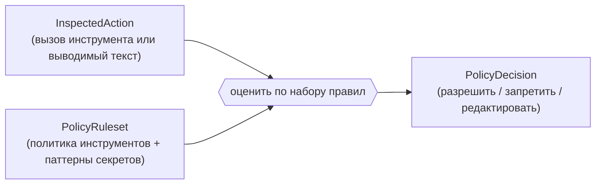

# agate-policy

> Ограниченный контекст политик: он решает вердикты о **контенте и авторизации**
> для действий, которые пытается совершить агент — какие инструменты могут
> выполняться и должен ли выводимый текст быть отредактирован до того, как
> достигнет клиента.

`agate-policy` — это **чистый, самодостаточный контекст**. Он говорит на
собственном вездесущем языке — `InspectedAction` на входе, `PolicyDecision` на
выходе — и **не зависит от других контекстов**. *Структурная* инспекция прокси и
эта *контентная* политика встречаются только в корне композиции [server](server.md),
который переводит между двумя словарями. **Общего ядра нет.**

## Ответственность

- **Авторизация инструментов:** решить, разрешён ли вызов инструмента, исходя из
  набора правил `AllowAll`, **списка разрешений** или **списка запретов**.
- **Редактирование секретов:** решить, должен ли выводимый текст быть
  отредактирован, исходя из набора паттернов секретов.

## Поток принятия решения

Корень композиции отображает `PolicyDecision` на `Verdict` прокси
(`Allow` / `Deny` / `Transform`), сохраняя контексты развязанными.

## Язык домена

- `InspectedAction` — вход: вызов инструмента или фрагмент выводимого текста.
- `PolicyDecision` — выход, вердикт в терминах политики.
- `PolicyRuleset` — настроенные правила: `ToolPolicy`, правила запрета аргументов
  и паттерны секретов.
- `ToolPolicy` — `AllowAll`, `Allowlist(set)` или `Denylist(set)`.
- `ArgumentRule` — запрещает разрешённый вызов инструмента, если его аргументы
  содержат маркер (опционально с привязкой к одному инструменту); применяется
  `ArgumentInspector` после авторизации имени.
- `ToolName`, `SecretPattern` — валидируемые объекты-значения (пустая или
  неверная запись отвергается при конструировании).

## Слои

| Слой | Содержимое |
| --- | --- |
| `domain` | Чистый: `InspectedAction`, `PolicyDecision`, `PolicyRuleset`, `ToolPolicy`, объекты-значения и доменный сервис оценки. Без async/I/O. |
| `application` | Сценарии над доменом (вычисление вердикта). |

Этот контекст сегодня мал и чист; слои `infrastructure`/`presentation` он
получает, только когда ему понадобятся собственные адаптеры.

## Конфигурация

Правила поставляются в корне композиции сервера из переменных окружения
`POLICY_*` (список разрешений / запретов / маркеры редактирования). Списки
разрешений и запретов **взаимоисключающие**; если ни один не задан, все
инструменты разрешены и ничего не редактируется. См.
[Конфигурацию](../../getting-started/configuration.md).
