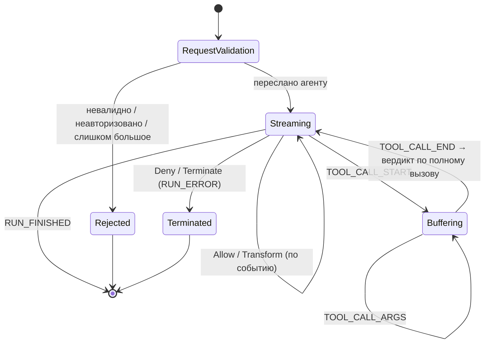

# agate-proxy

> Ограниченный контекст прокси: встроенный обратный прокси, который инспектирует
> трафик LLM-агента и решает — по каждому событию — разрешить, запретить,
> преобразовать, буферизовать или завершить его.

`agate-proxy` — это **плоскость данных**. Ядро инспекции **не зависит от
протокола**: проводной протокол (сначала AG-UI, позже адаптер агент ↔ LLM)
входит через **адаптер**, который переводит проводные события в доменные. Полный
дизайн см. в [Модели угроз](../threat-model.md).

## Ответственность

- Терминировать TLS и принимать AG-UI-запрос (`RunAgentInput`).
- **«Нога» запроса (превентивная):** валидировать, авторизовать и ограничивать
  размер запроса *до* пересылки — отвергать рано, чтобы агент не запускался на
  плохом вводе.
- **«Нога» ответа (потоковая):** инкрементально парсить SSE-поток событий и по
  каждому событию применять **вердикт** — пересылая, редактируя или завершая.
- Буферизовать фрагменты аргументов вызова инструмента между `TOOL_CALL_START`
  и `TOOL_CALL_END`, чтобы вердикт видел **полные** аргументы.
- Питать каждой парой `(событие, вердикт)` приёмник аудита, вне «горячего» пути
  пересылки.

## Конечный автомат инспекции

## Шов «событие → вердикт»

Инспекция производит, по каждому событию (или по буферизованной логической
единице), **вердикт**:

| Вердикт | Значение |
| --- | --- |
| `Allow` | переслать без изменений |
| `Deny(reason)` | заблокировать; на «ноге» ответа выдать как `RUN_ERROR` |
| `Transform(replacement)` | переслать изменённое событие (например, редактированный контент) |
| `Buffer` | нужно больше кадров перед решением (например, в середине вызова инструмента) |
| `Terminate(reason)` | завершить run/поток |

Этот единственный шов — место, куда через порты подключаются два контекста:
[`agate-policy`](policy.md) **вычисляет** вердикт (порт `PolicyPort`), а
[`agate-audit`](audit.md) **записывает** `(событие, вердикт)`. Прокси зависит
только от портов; конкретные адаптеры политики и аудита внедряются в корне
композиции [server](server.md). Первая веха поставляет тривиальный адаптер
политики **allow-all** за `PolicyPort`.

## Язык домена

- `Session` / `Run` — агрегат(ы) инспекции.
- `InspectedEvent` — объекты-значения событий, не зависящие от протокола.
- `Verdict` — объект-значение решения, перечисленный выше.

## Слои

| Слой | Содержимое |
| --- | --- |
| `domain` | Чистый: агрегаты инспекции, `InspectedEvent`, `Verdict`. Без I/O. |
| `application` | Сценарии и порты: `PolicyPort` (источник вердикта), приёмник аудита, клиент вышестоящего агента, рекордер `ProxyMetrics`. |
| `infrastructure` | Адаптеры: SSE-кодек AG-UI (инкрементальный, сохраняющий порядок), валидация `RunAgentInput`, HTTP-клиент к агенту. |
| `presentation` | HTTP/SSE-обработчики (axum/hyper), терминирование TLS, обвязка запрос/ответ. |
| `setup` | Корень композиции: `ProxyConfig` (`AGENT_ENDPOINT`, `BIND_ADDR`), сборка. |

## Наблюдаемость

Метрики плоскости данных идут **через порт `ProxyMetrics`**, а не через `counter!`
из слоя presentation. Обработчик запуска и потоковый инспектор фиксируют
`agate_runs_total`, `agate_events_inspected_total{outcome}` и
`agate_upstream_errors_total` через внедрённый порт — поэтому `inspect_stream`
принимает порт и юнит-тестируется с фейковым рекордером. Реальный адаптер пишет
через фасад `metrics` (no-op, пока [сервер](server.md) не установит рекордер
Prometheus).

## Fail-open или fail-closed

Будет ли ошибка политики приводить к **fail-open** (переслать) или
**fail-closed** (заблокировать) — это решение **на каждое развёртывание**, см.
[Конфигурацию](../../getting-started/configuration.md).
