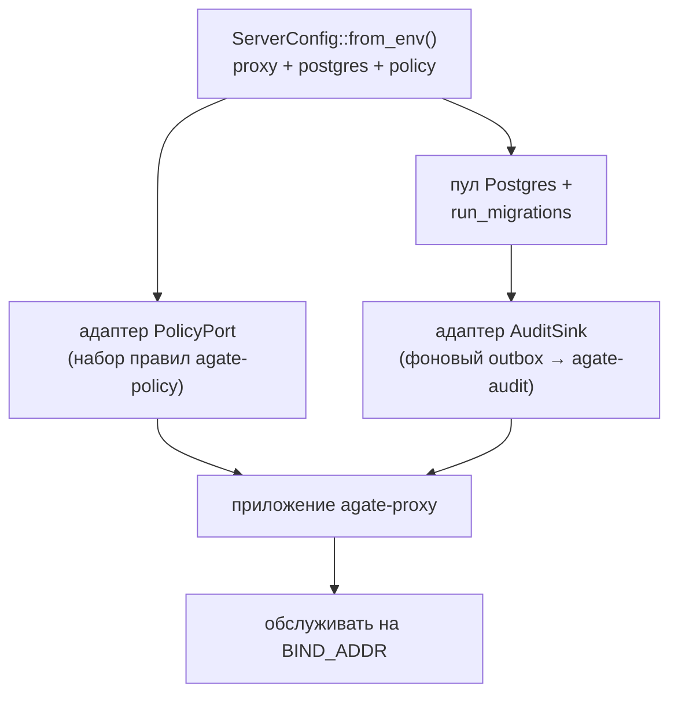

# agate-server

> Корень композиции для всей системы: он связывает плоскость данных **proxy** с
> журналом прозрачности **audit** и решениями **policy**, и является точкой
> входа Docker.

`agate-server` **не владеет собственным доменом**. Это самый внешний слой,
который компонует ограниченные контексты за их публичными портами.

## Ответственность

- Читать конфигурацию из окружения (`ServerConfig`: proxy + Postgres + policy).
- Строить пул Postgres и выполнять миграции аудита.
- Поставлять адаптеры, соединяющие контексты:
    - адаптер `PolicyPort`, опирающийся на [`agate-policy`](policy.md);
    - адаптер `AuditSink`, который превращает каждое инспектированное событие в
      добавление в журнал [`agate-audit`](audit.md) — **вне «горячего» пути
      пересылки** через фоновый outbox.
- Строить приложение прокси ([`agate-proxy`](proxy.md)) и обслуживать его.

## Композиция

Поскольку прокси зависит только от своих *портов* `PolicyPort` и `AuditSink`,
этот крейт — **единственное** место, где три контекста знают друг о друге, и
единственное место, где `PolicyDecision` переводится в `Verdict` прокси.

## Поведение точки входа

Поток `main`: прочитать конфигурацию → построить пул → миграции → разрешить
журнал прозрачности → построить приложение прокси → обслуживать.

- Если `AUDIT_LOG_ID` задан, этот журнал переиспользуется; иначе создаётся новый
  журнал, и его id выводится в лог, чтобы операторы могли закрепить его при
  перезапуске.
- См. [Установку](../../getting-started/installation.md) и
  [Конфигурацию](../../getting-started/configuration.md) за переменными
  окружения.

## Слои

| Слой | Содержимое |
| --- | --- |
| `infrastructure` | Адаптеры `AuditSink` / политики, соединяющие контексты. |
| `setup` | `ServerConfig` и бутстрап, который собирает и обслуживает приложение. |
