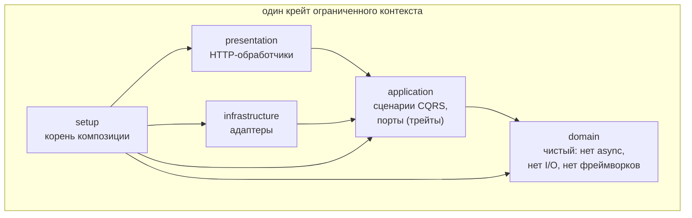
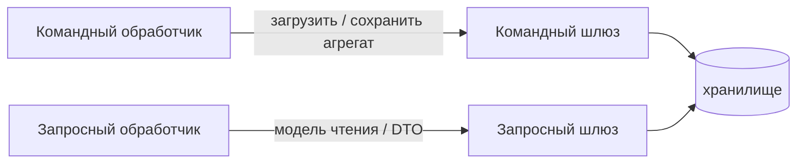

# Архитектура и DDD

Agate следует **Domain-Driven Design** и **Clean Architecture**. Эта страница
формулирует правила, которым подчиняется каждый крейт; они являются контрактом
для всех, кто работает в репозитории (см. `AGENTS.md`).

## Правило зависимостей

Зависимости направлены **только внутрь**. Внутри крейта ограниченного контекста
слои являются модулями, добавляемыми наружу по мере роста контекста:

- **Слой `domain` чист**: нет `async`, нет I/O, нет зависимостей от фреймворков.
  Это обеспечивается *структурно* ацикличным графом крейтов — модуль домена не
  может использовать то, чего нет в `Cargo.toml` крейта.
- **Полагайтесь на абстракции, а не на реализации.** Порты — это трейты; конкретные
  адаптеры внедряются в корне композиции. DI-фреймворк (`froodi`) остаётся вне
  слоёв domain и application.
- **Композиция вместо наследования.** В Rust нет наследования; переиспользование
  через трейты + методы по умолчанию, встраивание структур, дженерики и derive.

## Крейт = ограниченный контекст, без общего ядра

Каждый крейт владеет своими агрегатами и своим доменом. **Общего ядра нет.**
Межконтекстные *технические* возможности — криптография яркий пример —
публикуются как **библиотеки общего поддомена** со стабильным интерфейсом, а не
как разделяемые доменные модели. Зависимость от `agate-crypto` подобна
зависимости от `sha2` или `ring`: техническая возможность, а не общий домен.

Когда двум контекстам нужно взаимодействовать (например, структурной инспекции
прокси и решениям политики о контенте), они встречаются **только в корне
композиции**, который переводит между их словарями. Контексты никогда не
импортируют друг друга.

## Строительные блоки DDD в Rust

| Блок | Как реализован |
| --- | --- |
| **Объект-значение** | `#[derive(Clone, PartialEq, Eq, Hash)]` + `impl ValueObject`; приватные поля; валидирующий «умный» конструктор `new(..) -> Result<Self, DomainError>` (*parse, don't validate*); неизменяем — мутаторы возвращают новое значение. |
| **Сущность** | Реализует `Entity` (равенство по идентичности). Идентичность и жизненный цикл составлены из явных частей (поле `id` + объект-значение `Timestamps`), а не из мешка `Meta`. |
| **Корень агрегата** | Встраивает `EventCollection<E>`, реализует `AggregateRoot`. Конструирование доступно **только** через `Factory`, внедряющую коллабораторов; `new`/`reconstitute` — `pub(crate)`. |
| **Доменный сервис** | Структура-юнит без состояния + `impl DomainService`. |
| **Фабрика** | Единственный публичный способ построить агрегат; внедряет коллабораторов (clock, генератор id). |
| **Ошибки** | Иерархия вложенных `enum` (`DomainError::Time(TimeError)`), связанная через `Error::source()`. |
| **Порты** | `Clock` и `IdGenerator` — **доменные порты**. Персистентность и внешние системы — **порты приложения**, разделённые по CQRS: **командный шлюз** загружает/сохраняет агрегат (сторона записи); **запросный шлюз** возвращает модели чтения/DTO (сторона чтения). |

### Персистентность по CQRS

Персистентность разделена, чтобы модель записи (агрегат) и модель чтения
(DTO / проекции) развивались независимо:

## Почему это важно

Чистота домена и ацикличный граф крейтов означают, что критичная для
корректности логика (доказательства Меркла, вычисление вердикта, инварианты
объектов-значений) тестируется изолированно без сети и часов, а компилятор
обеспечивает слоистость. Алгебраические и криптографические инварианты (например,
round-trip доказательств Меркла, отклонение подделки) покрываются **proptest**;
контексты без таких инвариантов, например политики, используют сценарные
example-based тесты.

См. страницы по контекстам, где описано, как каждый крейт применяет эти правила:
[crypto](contexts/crypto.md), [audit](contexts/audit.md),
[proxy](contexts/proxy.md), [policy](contexts/policy.md),
[server](contexts/server.md).
