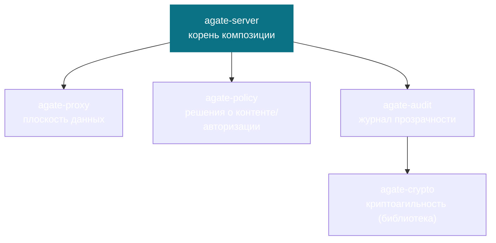

# Архитектура

Agate — это рабочее пространство Cargo, в котором **каждый крейт — это один
ограниченный контекст** (bounded context). Внутри контекста слои Clean
Architecture являются модулями, а файлы сгруппированы по типу DDD-объекта.
Зависимости направлены **только внутрь**, и **общего ядра (shared kernel) нет** —
межконтекстные технические возможности (например, криптография) публикуются как
*библиотеки* общего поддомена, а не как разделяемые доменные модели.

## Граф крейтов



`agate-server` компонует остальные за их публичными портами. `agate-proxy` и
`agate-policy` никогда не зависят друг от друга напрямую — их словари
встречаются только в корне композиции, который переводит между ними.
`agate-audit` зависит от `agate-crypto` ради стратегий хеширования и подписи.

## Единственный шов принятия решений

Вся система держится на одном шве в прокси: для каждого инспектированного
события (или каждой буферизованной логической единицы, такой как полный вызов
инструмента) производится **вердикт**.

```mermaid
flowchart LR
    ev["Инспектированное событие"] --> seam{{"событие → вердикт"}}
    seam --> allow["Allow — переслать без изменений"]
    seam --> deny["Deny — заблокировать (RUN_ERROR)"]
    seam --> transform["Transform — переслать изменённым"]
    seam --> buffer["Buffer — нужно больше кадров"]
    seam --> terminate["Terminate — завершить run"]
    seam -.->|спрашивает| policy["agate-policy"]
    seam -.->|записывает (событие, вердикт)| audit["agate-audit"]
```

## Читайте дальше

- **[Архитектура и DDD](ddd.md)** — правило зависимостей, решение об отсутствии
  общего ядра и строительные блоки DDD (объекты-значения, сущности, агрегаты,
  фабрики, порты) в применении к Rust.
- **[Модель угроз](threat-model.md)** — что защищает прокси, от кого и топология
  развёртывания.
- **Ограниченные контексты** — по странице на крейт:
  [crypto](contexts/crypto.md) ·
  [audit](contexts/audit.md) ·
  [proxy](contexts/proxy.md) ·
  [policy](contexts/policy.md) ·
  [server](contexts/server.md).
