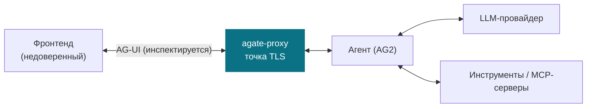

# Модель угроз

Эта страница выводит на поверхность принятый проектный документ ограниченного
контекста `agate-proxy` — плоскости данных, инспектирующей трафик LLM-агента.
Он определяет, **что защищает прокси, от кого, где он располагается и единственный
шов принятия решений** (событие → вердикт), к которому подключаются контексты
аудита и политик.

!!! note "Перевод канонической записи"
    Канонический источник истины — английский и находится в репозитории
    ([`docs/design/agate-proxy-threat-model.md`](https://github.com/C3EQUALZz/agate/blob/main/docs/design/agate-proxy-threat-model.md)).
    Ниже включён его русский перевод
    ([`docs/design/agate-proxy-threat-model.ru.md`](https://github.com/C3EQUALZz/agate/blob/main/docs/design/agate-proxy-threat-model.ru.md)).
    Перевод поддерживается в синхронизации с английским оригиналом через
    CI-страж дрейфа (`scripts/check-i18n.sh`): если английский документ
    меняется, проверка падает, пока перевод не обновят.

!!! abstract "Кратко"
    - **Режим:** гибридный встроенный (inline) — превентивный на «ноге» запроса,
      потоковая инспекция на «ноге» ответа.
    - **TLS:** терминируется на прокси (необходимо для инспекции открытого
      текста).
    - **Шов:** каждое инспектированное событие даёт вердикт
      (`Allow` / `Deny` / `Transform` / `Buffer` / `Terminate`); `agate-policy`
      его вычисляет, `agate-audit` его записывает.

---

--8<-- "design/agate-proxy-threat-model.ru.md"
