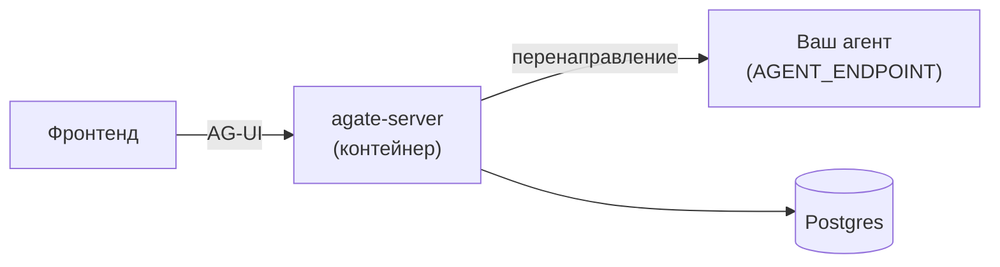

# Начало работы

Agate работает как один контейнер, который вы размещаете **перед** вашим
существующим AG-UI-агентом. Ваш фронтенд подключается к Agate, а не напрямую к
агенту; Agate инспектирует, принимает решение, записывает и перенаправляет.

Этот раздел охватывает:

1. **[Установка (Docker)](installation.md)** — получите/соберите образ, задайте
   несколько переменных окружения, укажите его на ваш агент и запустите.
2. **[Конфигурация](configuration.md)** — переменные окружения, которые Agate
   читает сегодня, и файловая конфигурация `agate.toml`, которая
   проектируется.

!!! note "Статус"
    Agate находится на ранней стадии разработки (`0.1.0`). Прокси плоскости
    данных, журнал прозрачности аудита и первая политика (разрешение/запрет
    инструментов + редактирование секретов) уже на месте. Опубликованный
    Docker-образ и файл конфигурации `agate.toml` ещё дорабатываются — см.
    примечания на каждой странице.
