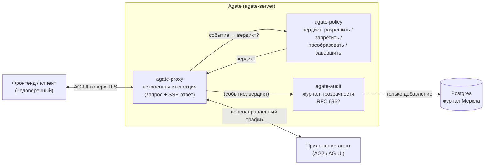

# Agate

**Agate — это шлюз безопасности для LLM-агентов.** Это встроенный обратный
прокси, который располагается перед агентским приложением, инспектирует трафик
в обоих направлениях, применяет политику к действиям агента и записывает каждое
решение в защищённый от подделки журнал прозрачности с возможностью только
добавления — **без изменения кода агента**.

Первый протокол, который понимает Agate, — это **AG-UI** (с
[AG2](https://docs.ag2.ai/) в роли эталонного агентского фреймворка), но ядро
инспекции не зависит от протокола: AG-UI — это лишь один адаптер, а адаптер
агент ↔ LLM-провайдер можно добавить позже, не трогая ядро.

## Какую проблему он решает

Протокол AG-UI — это HTTP-`POST` тела `RunAgentInput` (клиент → агент) плюс
поток событий Server-Sent Events в ответ (агент → клиент). Сам по себе он не
несёт ни аутентификации, ни подписей отдельных событий, ни ограничений размера,
и содержит множество нетипизированных полей формы `any`. Это означает:

- любой, кто достучится до эндпоинта, может управлять агентом;
- вызовы инструментов, изменения состояния и выводимый текст не проверяются;
- нет достоверной записи о том, что агента просили сделать и что он сделал.

Agate закрывает эти пробелы на сетевой границе. Он **аутентифицирует и
ограничивает** запрос, **инспектирует** потоковый ответ событие за событием,
применяет **вердикт политики** (разрешить / запретить / преобразовать /
завершить) и **добавляет** пару `(событие, вердикт)` в проверяемый журнал
прозрачности на дереве Меркла по [RFC 6962](https://www.rfc-editor.org/rfc/rfc6962).

## Архитектура в целом

Прокси терминирует TLS (чтобы инспектировать открытый текст), проверяет запрос
до того, как агент вообще запустится, затем стримит ответ, обращаясь к политике
и питая журнал аудита вне «горячего» пути.

## Как он устроен

Agate — это рабочее пространство (workspace) Cargo, где **каждый крейт — это
один ограниченный контекст** (bounded context), построенный по принципам
Domain-Driven Design и Clean Architecture. Зависимости направлены только внутрь;
общего ядра (shared kernel) нет.

| Крейт | Ограниченный контекст | Ответственность |
| --- | --- | --- |
| [`agate-crypto`](architecture/contexts/crypto.md) | Общий поддомен (библиотека) | Криптоагильность: подключаемые самоописывающиеся стратегии хеширования / подписи / AEAD |
| [`agate-audit`](architecture/contexts/audit.md) | Аудит | Журнал прозрачности RFC 6962 с возможностью только добавления |
| [`agate-proxy`](architecture/contexts/proxy.md) | Прокси (плоскость данных) | Встроенная инспекция трафика агента; шов «событие → вердикт» |
| [`agate-policy`](architecture/contexts/policy.md) | Политики | Решения о контенте и авторизации: разрешение/запрет инструментов + редактирование секретов |
| [`agate-server`](architecture/contexts/server.md) | Корень композиции | Связывает proxy ↔ audit ↔ policy; точка входа Docker |

## Что дальше

-   :material-rocket-launch: **[Начало работы](getting-started/index.md)**

    Запустите Agate перед своим агентом с помощью Docker.

-   :material-cog: **[Конфигурация](getting-started/configuration.md)**

    Сегодня — переменные окружения; монтируемый `agate.toml` в планах.

-   :material-sitemap: **[Архитектура](architecture/index.md)**

    Ограниченные контексты, правила DDD и модель угроз.

-   :material-book-open-variant: **[Справочник](reference/index.md)**

    Справочник API на rustdoc.

